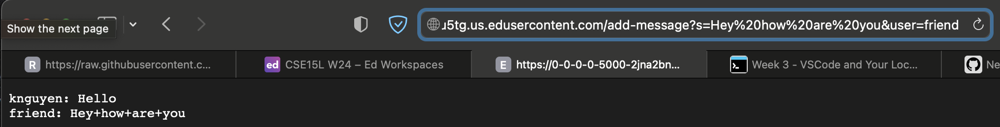
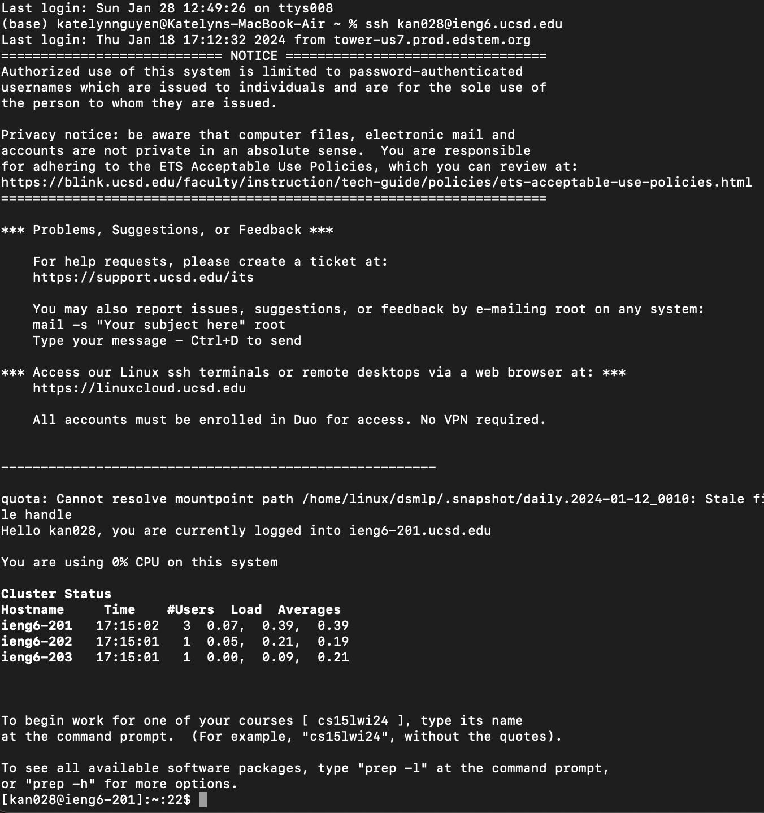

## Lab Report 2
#Part 1:
Code for ChatServer:
```
import java.io.IOException;
import java.net.URI;

class Handler implements URLHandler {
    String chatHistory = "";

    public String handleRequest(URI url) {
        if (url.getPath().equals("/")) {
            if (chatHistory.length() == 0) {
                return "Add a message to get started!";
            }
        } else if (url.getPath().equals("/add-message")) {
            String[] combined = url.getQuery().split("&");
            String msg = combined[0].split("=")[1];
            String user = combined[1].split("=")[1];
            chatHistory += String.format("%1$s: %2$s\n", user, msg);
        } else { //If not no path or add message path
            return "404 Not Found";
        }
        return chatHistory;
    }
}

class ChatServer {
    public static void main(String[] args) throws IOException {
        if(args.length == 0){
            System.out.println("Missing port number, try any number between 1024 to 49151");
            return;
        }

        int port = Integer.parseInt(args[0]);

        Server.start(port, new Handler());
    }
}
```
First usage of /add-message:

Second usage of /add-message:

#Part 2

#Part 3

