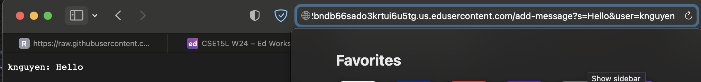

## Lab Report 2
## Part 1:
Code for ChatServer:
```
import java.io.IOException;
import java.net.URI;

class Handler implements URLHandler {
    String chatHistory = "";

    public String handleRequest(URI url) {
        if (url.getPath().equals("/")) {
            if (chatHistory.length() == 0) {
                return "Add a message to get started!";
            }
        } else if (url.getPath().equals("/add-message")) {
            String[] combined = url.getQuery().split("&");
            String msg = combined[0].split("=")[1];
            String user = combined[1].split("=")[1];
            chatHistory += String.format("%1$s: %2$s\n", user, msg);
        } else { //If not no path or add message path
            return "404 Not Found";
        }
        return chatHistory;
    }
}

class ChatServer {
    public static void main(String[] args) throws IOException {
        if(args.length == 0){
            System.out.println("Missing port number, try any number between 1024 to 49151");
            return;
        }

        int port = Integer.parseInt(args[0]);

        Server.start(port, new Handler());
    }
}
```
First usage of /add-message:


a) First, the main method in ChatServer is called. Inside this main method, the start method in Server.java (the class provided 
from Week 2) eventually calls my handleRequest method in the Handler class.
b) My main method has the parameter `args`: a String array that takes in the command line arguments passed in by the user.
The user should pass in one command line argument that should be the port number, which will then be stored in the variable `port`.
In this case, I passed in the port number 4001.
My handleRequest method has the parameter `url` of type URI. This contains the website url, ending in /add-message?s=Hello&user=knguyen
My Handler class has the field `chatHistory` of type String, which is a string that will hold all the added messages. If the user
adds a message, it is concatenated to this field, along with a newline character `\n`.
c) The `chatHistory` field is changed in this screenshot. "knguyen: Hello" and a newline character `\n` is concatenated to the
previously empty field. The value of `url` also changes because a new url is passed in, one containing /add-message?s=Hello&user=knguyen.
Inside my handleRequest method, the value of `msg` changes to be "Hello" and `user` changes to "knguyen". In the main method,
the port integer is 4001.


Second usage of /add-message:


a) The main method in ChatServer is first called. Inside the main method, the start method in Server.java (the class provided 
from Week 2) eventually calls my handleRequest method in the Handler class.
b) The main method has the parameter `args`, a String array that takes in the command line arguments passed in by the user.
I passed in one command line argument, the port number 4001, which is stored in the variable `port`.
My handleRequest method has the parameter `url` of type URI. This contains the website url, which has 
/add-message?s=Hey how are you&user=friend at the end.
My Handler class has the field `chatHistory` of type String, which is a string that will hold all the added messages. 
Messages are concatenated to this field, along with a newline character `\n`. Before this screenshot, it held "knguyen: Hello\n".
After, it held "knguyen: Hello\nfriend: Hey+how+are+you\n". 
c) The `chatHistory` field is changed in this screenshot. "friend: Hey+how+are+you" and a newline character `\n` is concatenated to it.
The value of `url` also changes because a new url is passed in, one containing /add-message?s=Hey how are you&user=friend.
Inside my handleRequest method, the value of `msg` changes to be "Hey+how+are+you" and `user` changes to "friend".
In the main method, the port integer is still 4001 because it is still on the same server and port.

## Part 2

## Part 3

