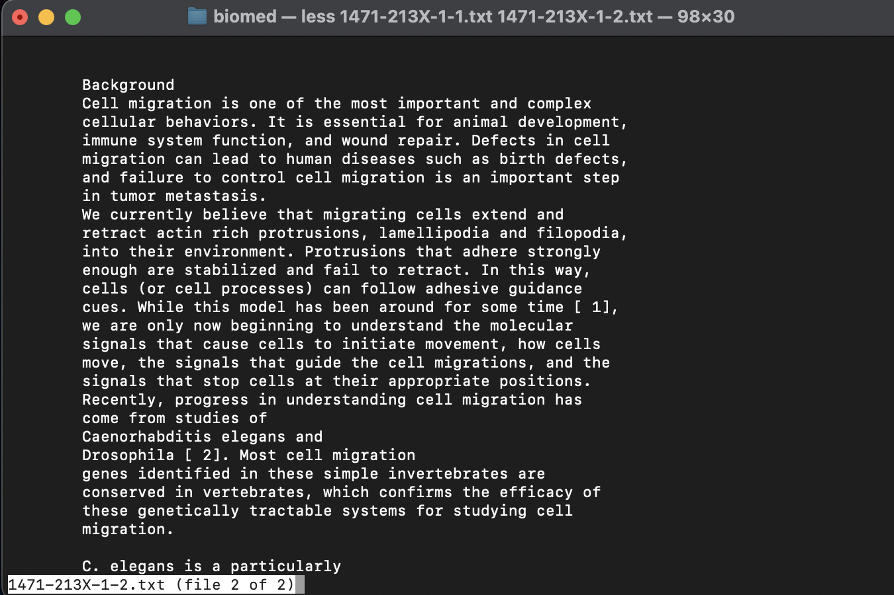
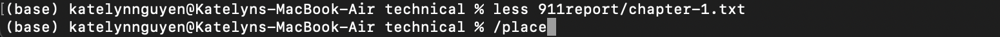

### Bug: 
filter method in the ListExampleS class
### Failure-inducing input:

My import statements:
```
import static org.junit.Assert.*;
import java.util.ArrayList;
import java.util.List;
import org.junit.*;
```

A class to implement the StringChecker interface- it returns true if the string starts with the character 's'
```
class StringChecker2 implements StringChecker {
    public boolean checkString(String s) {
        if (s.charAt(0) == 's') {
            return true;
        }
        return false;
    }
}
```

My JUnit Test:
```
public class ListTests {
    @Test
    public void testFilter() {
        List<String> stringList = new ArrayList<String>();
        stringList.add("string");
        stringList.add("ey");
        stringList.add("s2");
        List<String> stringList2 = new ArrayList<String>();
        stringList2.add("string");
        stringList2.add("s2");
        StringChecker2 sc = new StringChecker2();
        assertEquals(stringList2, ListExamples.filter(stringList, sc));
    }
```
The input is an ArrayList containing "string", "ey", and "s2", and the expected result is an ArrayList containing "string" and "s2" which both start with 's'.

### Input that doesn't induce a failure:
I added this JUnit Test to my ListTests class:
```
    @Test
    public void testFilter2() {
        List<String> stringList = new ArrayList<String>();
        stringList.add("string");
        stringList.add("ey");
        List<String> stringList2 = new ArrayList<String>();
        stringList2.add("string");
        StringChecker2 sc = new StringChecker2();
        assertEquals(stringList2, ListExamples.filter(stringList, sc));
    }
```
This test tests an ArrayList containing "string" and "ey", and since only the first string starts with 's', the expected result is an ArrayList only containing "string."/
### Symptom
Running JUnit with testFilter and testFilter2 (along with a testMerge function that is related to another function)

The result is that testFilter failed while testFilter2 succeeded.

Additional screenshots:
Running the tests through a VSCode extension:


### Bug, Before-change
```
  static List<String> filter(List<String> list, StringChecker sc) {
    List<String> result = new ArrayList<>();
    for(String s: list) {
      if(sc.checkString(s)) {
        result.add(0, s);
      }
    }
    return result;
  }
```
### Bug, After-change
```
  static List<String> filter(List<String> list, StringChecker sc) {
    List<String> result = new ArrayList<>();
    for(String s: list) {
      if(sc.checkString(s)) {
        result.add(s);
      }
    }
    return result;
  }
```
The fix was changing `result.add(0, s)` to `result.add(s)`. The bug was that it was prepending the valid strings to a new array, when it should be adding them to the end in order to preserve the order. I changed it so that it adds the valid strings to the end of the new array.

## Part 2:
-less command
1. Using -N
Source: Calling `man less` in the Terminal. [manual on less](https://man.archlinux.org/man/less.1#D)
My two examples were calling `less -N` on a file, and combining `less -N` with `-p pattern`.

a.

Adding in `-N` after less lists the line numbers of each line. This is useful since we can see how many total lines there are and where we are in the file.
b.

Once again, having the line numbers is useful so we can see where we are looking in the file. It is especially helpful when also using `-p`, so that we know what line we are on when looking for a specific word.

3. Viewing multiple files
Source: [Multiple files Link](https://www.thegeekstuff.com/2010/02/unix-less-command-10-tips-for-effective-navigation/)
a. 
Working directory: `/Users/katelynnguyen/docsearch/technical/biomed` and using less on two files in the current directory. I used `:n` and `:p` to go back and forth between the files.


I can also use less to look at multiple files. In this case, I provided two files in biomed, the current directory, as command line arguments. I was able to switch between the two files using `:n` and `:p` which is useful if I want to compare two files side by side.
b.
Working directory: `/Users/katelynnguyen/docsearch/technical`. Using less on two files in the 911report subdirectory.


In this case, I provided two files in 911report, the subdirectory in technical, as command line arguments. I was oncee again able to switch between the two files using `:n` and `:p`, and it was useful to know that I can also provide different paths to look at files.

5. Searching for a pattern/sequence of characters
Source: [Search resource link](https://ioflood.com/blog/less-linux-command/#Advanced_Usage_of_the_8216less8217_Linux_Command)
a. Typing in /word


I used less then typed in `/place` to search for the word 'place' in the file. It highlighted all of its occurrences, which is a helpful tool similar to the Command F shortcut to find a word or phrase.
b. Using -p pattern


This time, I used less with `-p place` to search for the word 'place' in the file. It highlighted all of its occurrences and brought me to them, and it is helpful to be able to search for a word in the same line that I called `less`.
