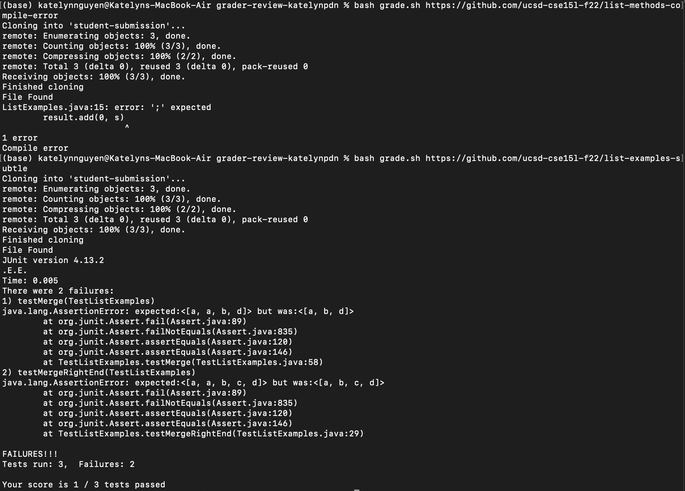
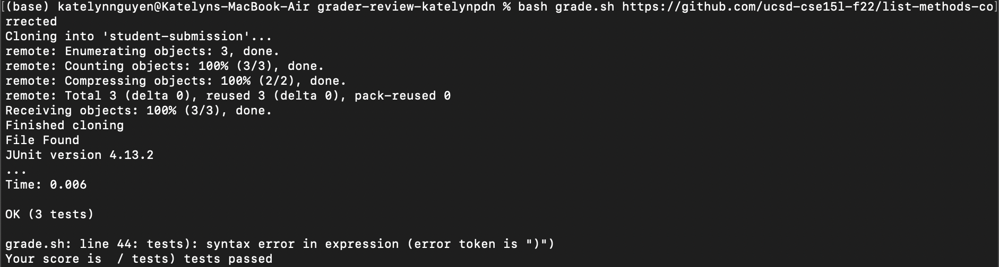
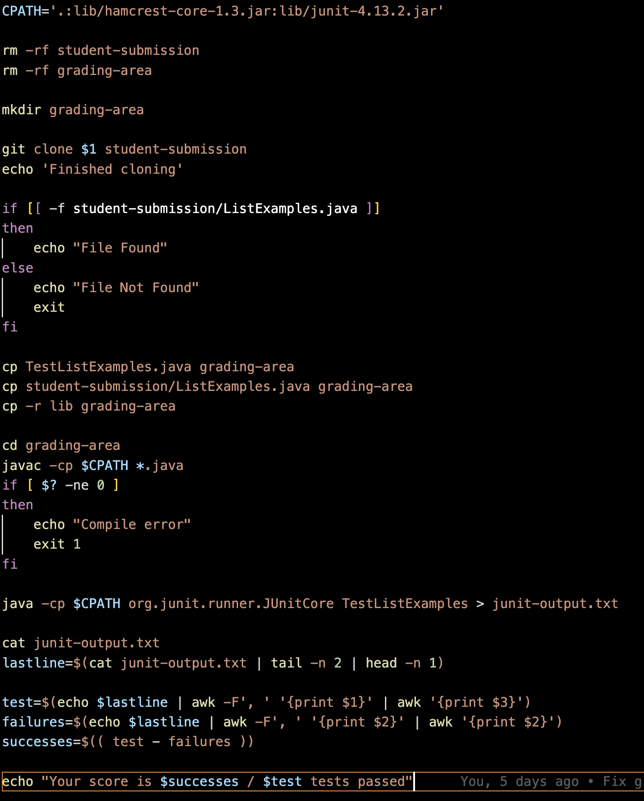

# Debugging Scenario

1. Post
   
Hello,

My bash grading script works on all the test Github repositories except one. For this test repository: `https://github.com/ucsd-cse15l-f22/list-methods-corrected`, my script ends up throwing the error `grade.sh: line 44: tests): syntax error in expression (error token is ")")`.

Here are test Github repositories that my script works on (it correctly identifies a compile error and an incorrect implementation):

Here is the test Github repository that it throws an error on, and the symptom:

Here is my grade.sh script for reference:


Since the symptom references line 44, I would guess that the bug may be that I am using improper parentheses syntax in this line 44 in `grade.sh`: `successes=$(( test - failures ))`. However, the syntax seems correct to me and I am confused why an error is only being thrown for one test and not the others.

2. TA Response
   
Hey Katelyn,

I recommend using `echo test` and `echo failures` to see what your variable values are. It may not neccessarily be a syntax error. The `awk` command may not be splicing correctly, so maybe check if your variables are saving the correct numbers.

3. Student Response
Thank you, I fixed the error!

I added the following lines before line 44 to check my variables:
```
echo "Test: $test"
echo "Failures: $failures"
```
After running the script on the same Github repo, I got the following output:
```
bash grade.sh https://github.com/ucsd-cse15l-f22/list-methods-corrected
Cloning into 'student-submission'...
remote: Enumerating objects: 3, done.
remote: Counting objects: 100% (3/3), done.
remote: Compressing objects: 100% (2/2), done.
remote: Total 3 (delta 0), reused 3 (delta 0), pack-reused 0
Receiving objects: 100% (3/3), done.
Finished cloning
File Found
JUnit version 4.13.2
...
Time: 0.005

OK (3 tests)

Test: tests)
Failures: 
grade.sh: line 45: tests): syntax error in expression (error token is ")")
Your score is  / tests) tests passed
```
My `test` and `failures` variables are incorrect. I realize that my script works if at least one JUnit test fails, because the output is formatted as `Tests run: 3,  Failures: 2`. But if all tests pass, the output is formatted `OK (3 tests)`, and so my `awk` commands splice inaccurately. To fix this, I added an if else statement to check if the JUnit output starts with `Tests` before calculating tests and failures. Otherwise, I print that all tests pass. Here are the changed lines:
```
cat junit-output.txt
lastline=$(cat junit-output.txt | tail -n 2 | head -n 1)
if [[ $(echo $lastline | awk '{print $1}') == "Tests" ]]
then
    test=$(echo $lastline | awk -F', ' '{print $1}' | awk '{print $3}')
    failures=$(echo $lastline | awk -F', ' '{print $2}' | awk '{print $2}')
    successes=$(( test - failures ))
else
    successes=3
    test=3
fi
echo "Your score is $successes / $test tests passed"
```
4. Information about Setup
File & directory structure:
In the `grader-review-katelynpdn` directory (before running grade.sh):
```
GradeServer.java
TestListExamples.java
Server.java
grade.sh
lib/
  hamcrest-core-1.3.jar
  junit-4.13.2.jar
```
In the `grader-review-katelynpdn` directory (after running grade.sh):
```
GradeServer.java
TestListExamples.java
grading-area/
  lib/
    ListExamples.class
    ListExamples.java
    TestListExamples.java
    TestListExamples.class
    junit-output.txt
lib/
  hamcrest-core-1.3.jar
  junit-4.13.2.jar
student-submission
Server.java
grade.sh
lib
```

Contents of grade.sh before fixing bug:
```
CPATH='.:lib/hamcrest-core-1.3.jar:lib/junit-4.13.2.jar'

rm -rf student-submission
rm -rf grading-area

mkdir grading-area

git clone $1 student-submission
echo 'Finished cloning'


# Draw a picture/take notes on the directory structure that's set up after
# getting to this point

# Then, add here code to compile and run, and do any post-processing of the
# tests
if [[ -f student-submission/ListExamples.java ]]
then
    echo "File Found"
else
    echo "File Not Found"
    exit
fi

cp TestListExamples.java grading-area
cp student-submission/ListExamples.java grading-area
cp -r lib grading-area

cd grading-area
javac -cp $CPATH *.java
if [ $? -ne 0 ]
then
    echo "Compile error"
    exit 1
fi

java -cp $CPATH org.junit.runner.JUnitCore TestListExamples > junit-output.txt

cat junit-output.txt
lastline=$(cat junit-output.txt | tail -n 2 | head -n 1)

    test=$(echo $lastline | awk -F', ' '{print $1}' | awk '{print $3}')
    failures=$(echo $lastline | awk -F', ' '{print $2}' | awk '{print $2}')
    successes=$(( test - failures ))

echo "Your score is $successes / $test tests passed"
```
Contents of grade.sh after fixing bug:
```
CPATH='.:lib/hamcrest-core-1.3.jar:lib/junit-4.13.2.jar'

rm -rf student-submission
rm -rf grading-area

mkdir grading-area

git clone $1 student-submission
echo 'Finished cloning'


# Draw a picture/take notes on the directory structure that's set up after
# getting to this point

# Then, add here code to compile and run, and do any post-processing of the
# tests
if [[ -f student-submission/ListExamples.java ]]
then
    echo "File Found"
else
    echo "File Not Found"
    exit
fi

cp TestListExamples.java grading-area
cp student-submission/ListExamples.java grading-area
cp -r lib grading-area

cd grading-area
javac -cp $CPATH *.java
if [ $? -ne 0 ]
then
    echo "Compile error"
    exit 1
fi

java -cp $CPATH org.junit.runner.JUnitCore TestListExamples > junit-output.txt

cat junit-output.txt
lastline=$(cat junit-output.txt | tail -n 2 | head -n 1)
if [[ $(echo $lastline | awk '{print $1}') == "Tests" ]]
then
    test=$(echo $lastline | awk -F', ' '{print $1}' | awk '{print $3}')
    failures=$(echo $lastline | awk -F', ' '{print $2}' | awk '{print $2}')
    successes=$(( test - failures ))
else
    successes=3
    test=3
fi
echo "Your score is $successes / $test tests passed"
```

Command Line to trigger bug:
```
bash grade.sh https://github.com/ucsd-cse15l-f22/list-methods-corrected
```

Description to fix bug:
We are going to add an `if then else` statement so that if the output starts with "Tests", we know at least one test fails and we use our previous code. The if statement checks using `awk` whether the first word is "Tests". Else, it sets `successes` and `test` to 3 so that it will show that 3/3 tests pass. 6 lines will be added in total.
So that the code block should look like this:
```
if [[ $(echo $lastline | awk '{print $1}') == "Tests" ]]
then
    test=$(echo $lastline | awk -F', ' '{print $1}' | awk '{print $3}')
    failures=$(echo $lastline | awk -F', ' '{print $2}' | awk '{print $2}')
    successes=$(( test - failures ))
else
    successes=3
    test=3
fi
```

# Reflection

In the second half of this quarter, I learned how to create, edit and delete files from the command line. By googling, I found that you can create a file using `touch fileName`. From the lab, I learned that I can edit the file by calling `vim fileName`. That particular lab really helped as I now know a lot of Vim shortcuts, how to edit the text, and how to save my changes. I also learned about deleting: to delete a file you call `rm fileName` and to delete a nonempty repository you call `rm -rf repoName`.
